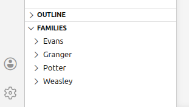
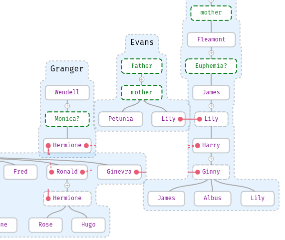
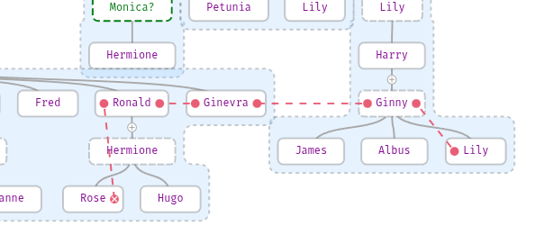
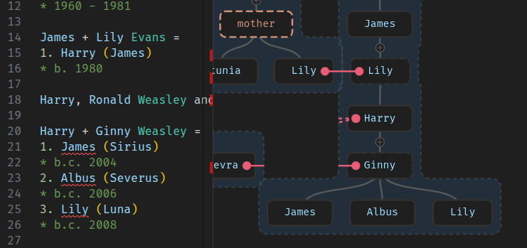

# FamilyMarkup

This extension provides support for [FamilyMarkup Language](https://familymarkup.com).

## Settings

- **Children Without Relationships** (enabled by default). As family grow to a large number of persons, it is easy to forget to describe a specific person's branch. This option highlights all children who lack family connections.

## Tree View

See all your families in one [folder-like](https://code.visualstudio.com/api/extension-guides/tree-view#treeview) tree view. You will find it under the files Explorer.



## Graph View

Automatically render your family data into graph trees with a custom-built layout engine designed to keep related families in close proximity, ensuring your genealogical map remains compact and logically organized. To open graph view, simply click the Preview icon in the editor title bar or use the Command Palette `Ctrl+Shift+P` to trigger the "Open Family Graph View" command.



Click on person will show it in editor. Click on red dots will scroll to connected person.
Select a name in the editor to highlight and scroll to the corresponding node in the graph.

## Find person

Use command `Find person` from Command Palette to quick search of specific person or family. No need to write full name just type first letters of name like `har pot` or `HarPot` for `Harry Potter`. In case if your family has few persons with same name then under each of them you will see some more details about to help you figure out.

## Show path between two persons

Highlights the shortest genealogical connection between two selected individuals.



## Themes support

Graph View will automatically adapt to your VS Code color theme.



## Markdown support

Extension supports syntax highlighting in preview of Markdown files and in Markdown files code blocks with `fml` or `family` syntax name. 

## Syntax Example

```family
Potter

James + Lily Evans = Harry

Weasley

Arthur + Molly? =
1. Fred
2. George
3. Ronald
4. girl

Fred and George - twins

Ronald and Harry Potter - best friends
```

In this example question marks after names shows that we don't remember maiden name of Molly and don't remember name of last child, only that it's a girl. Last two line shows relation between Fred and George, Ronald and Harry.

